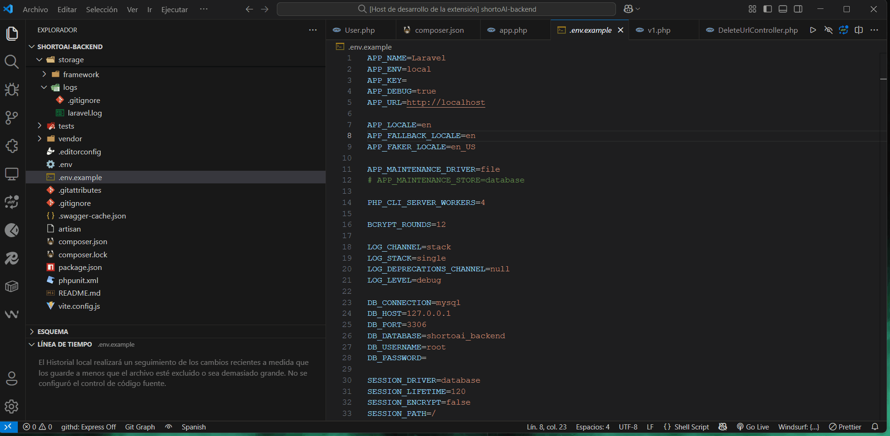

# Laravel SwaggenerAI

  

  
  
  

  

Generate Swagger/OpenAPI documentation for your Laravel APIs using AI. Supports multiple AI providers and features intelligent caching for optimal performance.

---

## Features

- 🤖 **Multiple AI Providers**  
  Choose your preferred AI service:
  - Google Gemini
  - OpenAI GPT-4
  - Anthropic Claude

- 📝 **Smart Generation**  
  - Automatic controller detection  
  - Routes and request analysis  
  - Intelligent caching for faster performance

- 🎨 **Customization**  
  - Flexible AI provider selection  
  - API key configuration  
  - Multiple formatting options  

---

## Quick Usage

  

1️⃣ Install the extension  
2️⃣ Configure your preferred AI provider  
3️⃣ Generate documentation with one click!  

---

## Documentation

For detailed guides, examples, and troubleshooting, visit the [Wiki](https://github.com/petersonsenadevs/laravel-swaggenerai/wiki).

---

## Changelog

### Version 1.0.1
- Translated extension documentation to English
- Updated README with English content
- Updated configuration descriptions to English
- Logo SwaggenerAI
- demo.gif

[View all updates](CHANGELOG.md)

---

## Support the Project

If you find this extension helpful, consider supporting it:

- ⭐ Star the [GitHub repo](https://github.com/petersonsenadevs/laravel-swaggenerai)
- ☕ [Buy me a coffee](https://www.buymeacoffee.com/petersonsenadevs)
- 📣 Share it with other developers!

---

## License

[MIT](LICENSE) © [Peterson Sena](https://github.com/petersonsenadevs)
